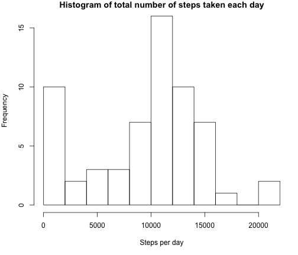
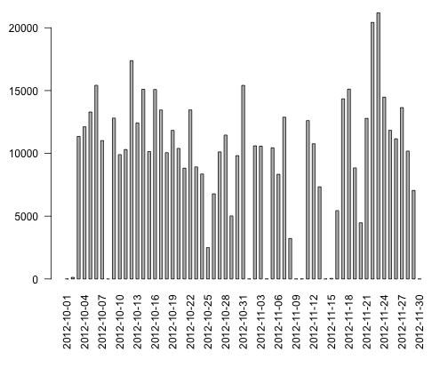
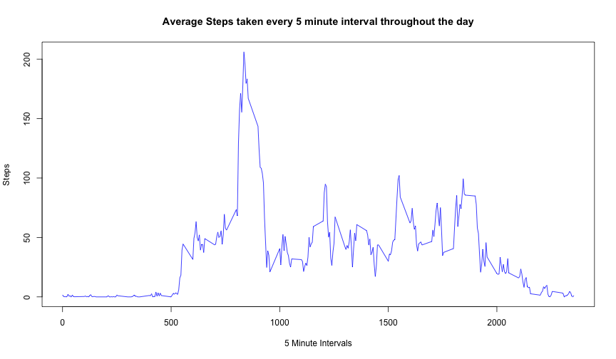
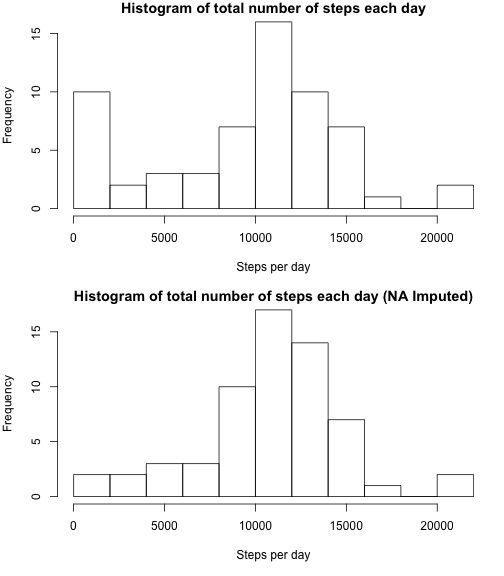
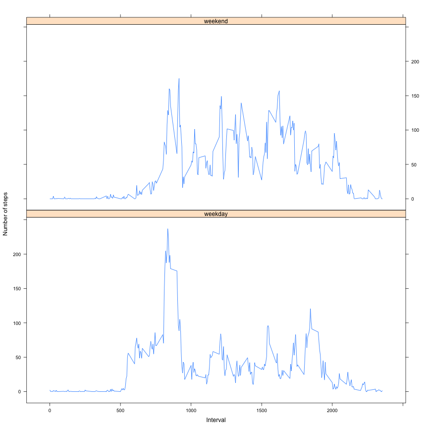

## Loading and preprocessing the data


We will load the activity data captured from the cellphones from file activity.zip. We will cache the dataset captured for future use.
We will change teh date column to a Date field and also transform the data_frame to tbl_df format used by dplyr.


```r
read.zip <- function(zipFile) {
        zipFileDir <- dirname(zipFile)
        setwd(zipFileDir)
        zipdir <- tempfile()
        dir.create(zipdir)
        unzip(zipFile, exdir = zipdir)
        filesInArchive <- list.files(zipdir)
        csvFile <- paste(zipdir, filesInArchive[1], sep = "/")
        read.csv(csvFile, header = T)
}

activityData <- read.zip("~/Documents/Coursera/ReproducibleResearch/RepData_PeerAssessment1/activity.zip")
dim(activityData)
```

```
## [1] 17568     3
```

```r
colnames(activityData)
```

```
## [1] "steps"    "date"     "interval"
```

```r
library(dplyr, quietly = TRUE)
```

```
## 
## Attaching package: 'dplyr'
## 
## The following object is masked from 'package:stats':
## 
##     filter
## 
## The following objects are masked from 'package:base':
## 
##     intersect, setdiff, setequal, union
```

```r
activityData <- tbl_df(activityData)
activityData <- mutate(activityData, date = as.Date(date))
activityData
```

```
## Source: local data frame [17,568 x 3]
## 
##    steps       date interval
## 1     NA 2012-10-01        0
## 2     NA 2012-10-01        5
## 3     NA 2012-10-01       10
## 4     NA 2012-10-01       15
## 5     NA 2012-10-01       20
## 6     NA 2012-10-01       25
## 7     NA 2012-10-01       30
## 8     NA 2012-10-01       35
## 9     NA 2012-10-01       40
## 10    NA 2012-10-01       45
## ..   ...        ...      ...
```

## What is mean total number of steps taken per day?

Now, we will try to explore the data to calculate the daily total steps taken by the person. The following is the code.


```r
library(dplyr, quietly = TRUE)
dailySteps <- activityData %>%
        group_by(date) %>%
        summarize(totalSteps = sum(steps, na.rm = T))
dailySteps
```

```
## Source: local data frame [61 x 2]
## 
##          date totalSteps
## 1  2012-10-01          0
## 2  2012-10-02        126
## 3  2012-10-03      11352
## 4  2012-10-04      12116
## 5  2012-10-05      13294
## 6  2012-10-06      15420
## 7  2012-10-07      11015
## 8  2012-10-08          0
## 9  2012-10-09      12811
## 10 2012-10-10       9900
## ..        ...        ...
```

```r
noOfDays <- dim(dailySteps)[1]
noOfDays
```

```
## [1] 61
```

Let us discover the person's daily steps through some basic statistical summaries.


```r
summary(dailySteps$totalSteps)
```

```
##    Min. 1st Qu.  Median    Mean 3rd Qu.    Max. 
##       0    6778   10400    9354   12810   21190
```

Now, we will plot this daily steps on a histogram to see discover the frequency of number of steps taken over the 61 day period.


```r
printHistogram <- function(dailySteps, plotTitle) {
        par(mar = c(5, 4, 1, 1))
        with (
                dailySteps, 
                hist(totalSteps, 
                     main = plotTitle, 
                     breaks = 15, 
                     xlab = "Steps per day")
        )
}
printHistogram(dailySteps, "Histogram of total number of steps taken each day")
```

 

Let us also look at the daily steps over the 61 day period with the help of a bar plot.


```r
printBarPlot <- function() {
        par(mar = c(8, 4, 1, 1))
        nolabels <- dim(dailySteps)[1]
        datelabels <- rep(NA, nolabels)
        datelabels[seq(1,nolabels,3)] <- strftime(dailySteps$date[seq(1,nolabels,3)], "%Y-%m-%d")
        datelabels <- as.Date(datelabels, "%Y-%m-%d")
        barplot(dailySteps$totalSteps, space = 1, las = 2, names.arg = datelabels)
}
printBarPlot()
```

 

Finally, let us take a look at the mean and median of total steps per day


```r
meanStepsPerDay <- mean(dailySteps$totalSteps)
medianStepsPerDay <- median(dailySteps$totalSteps)
print(paste("Mean Steps per day:", meanStepsPerDay, sep = " "))
```

```
## [1] "Mean Steps per day: 9354.22950819672"
```

```r
print(paste("Median Steps per day:", medianStepsPerDay, sep = " "))
```

```
## [1] "Median Steps per day: 10395"
```

## What is the average daily activity pattern?

Let us now look at how the person's activity varied over the different 288 (24 hours * 12 obesrvaions per hour) 5 minute intervals recorded.


```r
library(dplyr, quietly = TRUE)
summaryByInterval <- activityData %>%
        group_by(interval) %>%
        summarize(steps = mean(steps, na.rm = TRUE))
with (
        summaryByInterval,
        plot(x=interval, y = steps, type = "l",
             xlab = "5 Minute Intervals",
             ylab = "Steps",
             main = "Average Steps taken every 5 minute interval throughout the day",
             col = "blue"
             ),
)
```

 

So, it does look like that the person is the most active right around 9:00 in the morning. As expected, he is not taking many steps before 5:00 in the morning (no sleep-walker here!!), and also not much after 8:00PM. He steps are reasonably well spread throughout the day except for the peak period in the morning. May be he goes for a run???

Let us evaluate which 5 minute interval he has recorded the most steps on an average.


```r
summaryByInterval[summaryByInterval$steps == max(summaryByInterval$steps),]
```

```
## Source: local data frame [1 x 2]
## 
##   interval    steps
## 1      835 206.1698
```


## Imputing missing values

We see a lot of NA values in the steps observation. Let us see how many.


```r
library(dplyr, quietly = TRUE)
noStepsRecorded <- activityData[is.na(activityData$steps),]
numberOfNAObservations <- dim(noStepsRecorded)[1]
percentageOfNAObservations <- 100.0 * numberOfNAObservations / dim(activityData)[1]
print(c(numberOfNAObservations, percentageOfNAObservations))
```

```
## [1] 2304.00000   13.11475
```

So, we have a total of 2304 missing observations, which amounts to 13.1147541 percent of the entire data set.

Now let us see the daily distribution of missing observations.


```r
library(dplyr, quietly = TRUE)
NAByDay <- noStepsRecorded %>%
        group_by(date) %>%
        summarize(cnt = length(steps)) %>%
        mutate(wkday = weekdays(date)) %>%
        select(date, wkday, cnt)
NAByDay
```

```
## Source: local data frame [8 x 3]
## 
##         date     wkday cnt
## 1 2012-10-01    Monday 288
## 2 2012-10-08    Monday 288
## 3 2012-11-01  Thursday 288
## 4 2012-11-04    Sunday 288
## 5 2012-11-09    Friday 288
## 6 2012-11-10  Saturday 288
## 7 2012-11-14 Wednesday 288
## 8 2012-11-30    Friday 288
```


It is clear, that we have 8 days for which we have all 288 observations missing. He was definitely not using the smartphone device on those days.

We will use the following strategy for filling out the missing values in a realistic way.

1. Create a dataset from activityData that do not have any missing values
2. Add a column weekday (Sunday - Saturday) to the dataset
3. Now summarize the data to compute the mean ane median steps for each weekday and each time interval
4. Fill out the missing values by using this dataset as a reference dataset. So, if we are missing the value for 2012-10-01 (Monday) for time interval 500, then we will populate the corresponding value (Monday and Interval 500) from our reference dataset derived in step 3. In our case we choose the mean over the median.


```r
library(dplyr, quietly = TRUE)
imputeMissingData <- function(activityData) {
        # Add weekday to activitydata
        activityData <- activityData %>%
                mutate(wkday = weekdays(date)) %>%
                select(date, wkday, interval, steps)
        
        # Now get mean and median of steps for each interval per weekday
        avgStepsByWeekday <- activityData %>%
                filter(!(date %in% NAByDay$date)) %>%
                group_by(wkday, interval) %>%
                summarise(meanSteps = round(mean(steps)), medianSteps = round(median(steps) * 1.0))
        
        # Create the imputed data for all missing data
        derivedSteps <- activityData %>%
                filter(date %in% NAByDay$date) %>%
                inner_join(avgStepsByWeekday, by=c("wkday", "interval")) %>%
                mutate(steps = meanSteps) %>%
                select(date, wkday, interval, steps)
        
        # Create a subset of the original data with no missing values
        origSteps <- activityData %>%
                filter(!(date %in% NAByDay$date))
        
        # Combine the two data frames to create the final imputed data frame
        activityDataImputed <- rbind(origSteps, derivedSteps)
        
        # Order by date, interval
        activityDataImputed <- arrange(activityDataImputed, date, interval)
        
        activityDataImputed
}
activityDataImputed <- imputeMissingData(activityData)
activityDataImputed
```

```
## Source: local data frame [17,568 x 4]
## 
##          date  wkday interval steps
## 1  2012-10-01 Monday        0     1
## 2  2012-10-01 Monday        5     0
## 3  2012-10-01 Monday       10     0
## 4  2012-10-01 Monday       15     0
## 5  2012-10-01 Monday       20     0
## 6  2012-10-01 Monday       25     5
## 7  2012-10-01 Monday       30     0
## 8  2012-10-01 Monday       35     0
## 9  2012-10-01 Monday       40     0
## 10 2012-10-01 Monday       45     0
## ..        ...    ...      ...   ...
```

Now, let us re-create the daily steps dataset with the imputed data.


```r
library(dplyr, quietly = TRUE)
dailyStepsImputed <- activityDataImputed %>%
        group_by(date) %>%
        summarize(totalSteps = sum(steps))
```

And, plot the histogram of daily total steps. For comparison, we plot the original histogram too.


```r
par(mfrow=c(2,1))
printHistogram(dailySteps, "Histogram of total number of steps each day")
printHistogram(dailyStepsImputed, "Histogram of total number of steps each day (NA Imputed)")
```

 

The histogram from the imputed data looks closer to a normal distribution. Let us look at the mean ane median as well.


```r
summaries <- data.frame(
        c(mean(dailySteps$totalSteps, na.rm = TRUE), 
          mean(dailyStepsImputed$totalSteps, na.rm = TRUE)
        ),
        c(median(dailySteps$totalSteps, na.rm = TRUE), 
          median(dailyStepsImputed$totalSteps, na.rm = TRUE)
        ),
        row.names = c("Original", "NA Imputed"))
colnames(summaries) <- c("Mean", "Median")
summaries
```

```
##                Mean Median
## Original    9354.23  10395
## NA Imputed 10821.10  11015
```

Both the mean and the median of the imputed data are somewhat higher than the original values, implying the weekdays for which data was missing are probably days when the individual walks more on an average. Remember, our imputation was derived basd on the week day.


## Are there differences in activity patterns between weekdays and weekends?

Create a data frame for translating Week Days to "weekday" and "weekend". Then add this translation to our imputed data.


```r
library(dplyr, quietly = TRUE)
translateWeekDay <- data.frame(c("Monday", "Tuesday", "Wednesday", "Thursday", "Friday", "Saturday", "Sunday"),
                               c(rep("weekday", 5), rep("weekend", 2)),
                               row.names = NULL,
                               stringsAsFactors = FALSE)
colnames(translateWeekDay) <- c("wkday", "daytype")
activityDataImputed <- activityDataImputed %>%
        inner_join(translateWeekDay, by = c("wkday")) %>%
        select(date, daytype, wkday, interval, steps)
activityDataImputed$daytype = factor(activityDataImputed$daytype, levels=c("weekday", "weekend"))
activityDataImputed
```

```
## Source: local data frame [17,568 x 5]
## 
##          date daytype  wkday interval steps
## 1  2012-10-01 weekday Monday        0     1
## 2  2012-10-01 weekday Monday        5     0
## 3  2012-10-01 weekday Monday       10     0
## 4  2012-10-01 weekday Monday       15     0
## 5  2012-10-01 weekday Monday       20     0
## 6  2012-10-01 weekday Monday       25     5
## 7  2012-10-01 weekday Monday       30     0
## 8  2012-10-01 weekday Monday       35     0
## 9  2012-10-01 weekday Monday       40     0
## 10 2012-10-01 weekday Monday       45     0
## ..        ...     ...    ...      ...   ...
```

Now we will compute average number of steps taken over weekday/weekend and time interval.


```r
library(dplyr, quietly = TRUE)
avgByDaytype <- activityDataImputed %>%
        group_by(daytype, interval) %>%
        summarize(steps = mean(steps))
avgByDaytype
```

```
## Source: local data frame [576 x 3]
## Groups: daytype
## 
##    daytype interval      steps
## 1  weekday        0 2.28888889
## 2  weekday        5 0.44444444
## 3  weekday       10 0.17777778
## 4  weekday       15 0.20000000
## 5  weekday       20 0.08888889
## 6  weekday       25 1.55555556
## 7  weekday       30 0.62222222
## 8  weekday       35 1.15555556
## 9  weekday       40 0.00000000
## 10 weekday       45 1.80000000
## ..     ...      ...        ...
```

And we will plot a line plot showing this data with interval plotted along the x axis and the average steps on the y axis. The two lines corresponding to weekday and weekend will be in two different plots.


```r
library(lattice)
xyplot(
        steps ~ interval | daytype, 
        data = avgByDaytype, 
        layout = c(1,2), 
        type = "l", 
        xlab = "Interval",
        ylab = "Number of steps")
```

 

So, it looks like that there is a big spike of activity at around 8:30AM on weekdays, whereas, the activity is more evenly distributed throughout the day on weekends.


